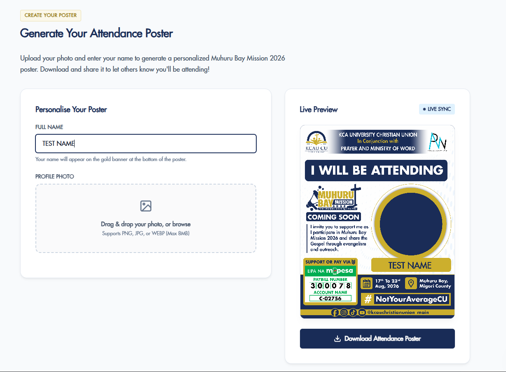

# KCAU CU E-Proformas

## Overview

This repository contains a React + Vite web app for generating a personalized Muhuru Bay Mission 2026 attendance poster.

The app allows a user to upload a profile photo, enter their full name, adjust the photo position/zoom/rotation, and download a finished poster image with the mission branding and name rendered on a template.

## Screenshot



## How it works

- `src/App.jsx` is the main application shell.
  - It handles file upload, drag-and-drop, validation, error messages, and the poster form controls.
  - It stores user state for the photo URL, attendee name, crop offsets, zoom, rotation, and download readiness.
- `src/components/PosterCanvas.jsx` renders the final poster into an off-screen HTML `<canvas>`.
  - It loads the event poster template image from `public/template.png`.
  - It draws the template, clips the uploaded profile photo into a circular frame, applies rotation/zoom/crop, and then renders the attendee name onto the poster.
- `src/config.js` contains event-specific configuration.
  - It defines template dimensions, template image path, photo position and radius, text placement, fonts, colors, and branding data.
- `src/main.jsx` bootstraps the React app into the DOM.
- `src/index.css` contains the application styles and layout rules.

## Key features

- Image upload with drag-and-drop support.
- JPG / PNG / WEBP validation and 20MB file size limit.
- Live canvas preview of the rendered poster.
- Photo positioning via dragging inside the preview area.
- Zoom and rotation controls for the uploaded photo.
- Automatic text resizing and line wrapping for long names.
- Downloadable poster output as a PNG file.

## Folder structure

- `src/`
  - `App.jsx` — main app and user interface
  - `main.jsx` — React entry point
  - `config.js` — event and canvas configuration values
  - `index.css` — global styles
  - `components/PosterCanvas.jsx` — canvas rendering component
- `public/`
  - `template.png` — base poster design
  - `logo.png`, `event-logo.png`, `partner*.jpeg/png` — branding assets used in the app

## Running the app

1. Install dependencies:

```bash
npm install
```

2. Start the development server:

```bash
npm run dev
```

3. Open the local Vite URL shown in the terminal.

4. Use the app to upload a photo, enter a name, adjust the image, and click `Download Attendance Poster`.

## Build and preview

- Build for production:

```bash
npm run build
```

- Preview the production build locally:

```bash
npm run preview
```

## Customization

To adapt the poster generator for another event, update `src/config.js`:

- `CONFIG.event` for event title, date, venue, and organizer
- `CONFIG.payment` for payment details
- `CONFIG.branding` for logos and partner assets
- `CONFIG.canvas.templateUrl` for the poster background file
- `CONFIG.canvas.photo` for the circular photo placement and radius
- `CONFIG.canvas.name` for text placement, font, color, and sizing

## Notes

- The app uses the browser Canvas API, so the download feature works best in modern browsers.
- The poster image is generated entirely client-side, with no server required.
- Uploaded images are converted to object URLs and revoked when replaced or removed to prevent memory leaks.
